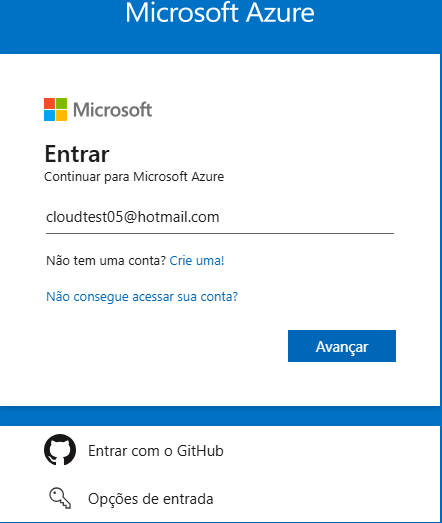
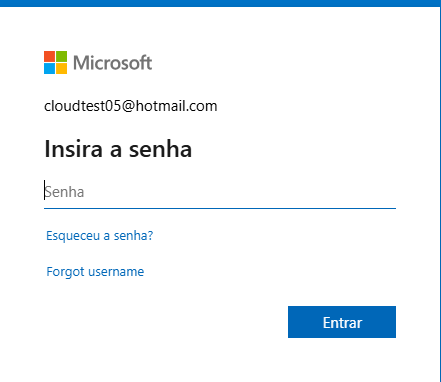
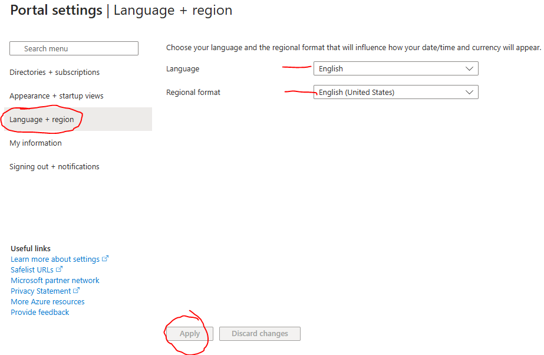
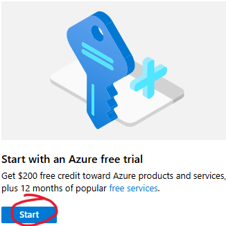
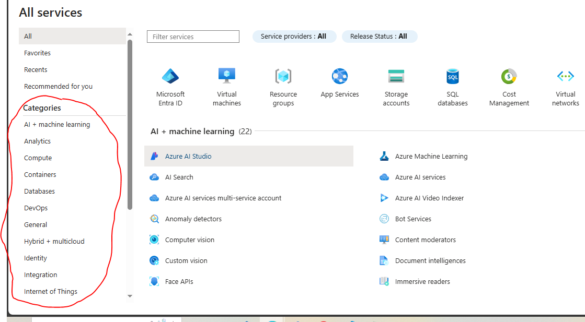

# Portal Azure
## Objetivo 
Acessar e se familiarizar com o Portal do Azure

### Instruções: 
 
1. #### Criar e Configurar uma Conta no Azure Free
   - Acesse [Microsoft Azure](https://portal.azure.com) 
     - Insira suas credencias - ex: xxxx@hotmail.com e senha " **** " 📋 *De preferência use email da microsoft caso não tenha um [clique aqui](https://signup.live.com/) e faça um email* 📋

     
     

     - No primeiro acesso o idioma será definido de acordo com o idioma do navegador padrão. Para mudar o idioma no canto superior direito clique em  Settings e *"Language + Region"* , altere o idioma de acordo com sua preferência e clique em *"Apply" e "Ok"*.

     

     - Volte a página inicial , em *"Start with an Azure free trial"* clique em *"Start"* e clique em *"Try Azure Free"* 
     
     
     - Na próxima etapa preencha todas as informações, será obrigatório ter um cartão de credito valido para finalizar a Subscription do Azure.
     - Importante: Somente terá acesso aos recursos do Azure depois que fazer a sua Subscription Free.  
     - Volte a pagina inicial do Portal , role para baixo até *"resources"* e verá sua Subscription do Azure ativa.
     

2. #### Explore o Portal
   -  Feedback - Contribuir com sugestões de melhorias para a plataforma.
   -  Support - Tentar solucionar problemas com a base de informações da Microsoft ou Abrir um Ticket com Microsoft para solução de algum problema.
   -  Settings - Configurações Gerais
   -  Notifications - Avisos de status de implementações, Erros, Gastos, etc.
   -  Cloud Shell -  Temos o Bash e PowerShell para realizar implementações de resources, polices, ... através de comandos.
   -  Blade - Quadro que mostra os resources favoritos.
   -  Search Resources - Barra para pesquisar recursos pelo nome.
   
   - Na pagina inicial procure por Azure Services e clique *" More Services"* - poderá visualizar todos os resources por categoria.

     

### Conclusão
Parabéns! Agora está familiarizado com o Portal do Azure. A partir daqui, poderá explorar mais recursos e serviços oferecidos pelo Azure para expandir suas habilidades e conhecimentos.